# Дневник смен водителя

Тестовое задание arqa. Сервер на FastAPI отдаёт поездки водителя и сводку за день, неделю
и месяц. Приложение на Flutter показывает их, переключает дни и добавляет поездки без дублей. Задание своими словами,
с номерами требований — [docs/requirements.md](docs/requirements.md).

**Стек:** Flutter 3.47 (BLoC, injectable, retrofit, freezed) · Python 3.14 (FastAPI, Pydantic v2) ·
Postgres 18

**Статус:** бэкенд, приложение и CI готовы. Бэкенд работает в интернете:
[driver-shifts-api.onrender.com](https://driver-shifts-api.onrender.com/docs) (X8). APK —
[v0.2.0 в Releases](https://github.com/m1roxx/driver_shifts/releases/tag/v0.2.0) (X4).

## Запуск

### Бэкенд

Нужен Docker с Compose v2 и свободный порт 8000.

```bash
make up
```

Поднимает Postgres 18 и API на `http://localhost:8000` с поездками из
[data/trips.json](data/trips.json). Описание API — `http://localhost:8000/docs`.

Проверка в другом терминале:

```bash
curl -s http://localhost:8000/api/v1/days/2026-10-01
```

В ответе сводка из задания — 2 поездки, выручка 3 900 ₸, комиссия 585 ₸, на руки 3 315 ₸,
наличные / карта 1 500 / 2 400 ₸:

```
"summary":{"trips_count":2,"revenue":3900,"commission":585,"net":3315,"by_payment":{"cash":1500,"card":2400}}
```

Сводки за 30.09–03.10 и зачем там поездки в 00:30 и через полночь — в
[data/README.md](data/README.md).

Последние 14 дней по Алматы, включая сегодня, заполнены демо-поездками (`id` вида
`demo-2026-10-06-1`), поэтому приложение не пустое в любой день. Сегодня видны только уже
закончившиеся поездки. Дни 30.09–03.10 демо не трогает: 01.10 — ровно сводка из задания.
Число дней задаёт переменная `DEMO_DAYS` (по умолчанию `0`, демо выключено; в
`docker-compose.yml` и `render.yaml` — `14`, не больше 31). Окно сдвигается при каждом старте
бэкенда. Если Blueprint на Render не синхронизирован с `render.yaml`, `DEMO_DAYS` нужно задать
в настройках сервиса вручную ([D13](docs/decisions.md#d13-демо-поездки-за-последние-дни)).

Защита от дублей. Отправьте поездку, затем ту же ещё раз: первый ответ `201`, второй `200`,
в сводке 01.10 — 3 поездки, а не 4. Тот же `id` с другой суммой (`"amount": 1100`) — `409`.

```bash
trip='{"id": "demo-1", "start": "2026-10-01T10:00:00+05:00", "end": "2026-10-01T10:20:00+05:00",
  "amount": 1000, "payment": "cash", "commission": 150}'
curl -s -w '\n%{http_code}\n' -H 'Content-Type: application/json' -d "$trip" \
  http://localhost:8000/api/v1/trips
```

Остановить — `Ctrl+C`. Данные лежат в томе Docker и переживают перезапуск; удалить их —
`docker compose down -v`. Если поменять `data/trips.json` на старой базе, бэкенд не стартует
([D10](docs/decisions.md#d10-хранилище-postgres-sql-без-orm)): сначала `docker compose down -v`.

### Приложение

Нужны [fvm](https://fvm.app) и Xcode или Android SDK. Бэкенд из `make up` должен работать.

```bash
cd app
fvm install                                                        # один раз: Flutter из app/.fvmrc
fvm flutter run --dart-define-from-file=env/ios-simulator.json     # симулятор iOS
fvm flutter run --dart-define-from-file=env/android-emulator.json  # эмулятор Android
```

Телефон в той же сети, что и компьютер (тоже из `app/`):

```bash
cp env/local.example.json env/local.json                           # вписать IP компьютера
fvm flutter run --dart-define-from-file=env/local.json
```

Адрес API задаётся только файлом из [app/env/](app/env/), в коде его нет
([D12](docs/decisions.md#d12-адрес-api-и-демо-бэкенд-в-интернете)). Обычный `http` разрешён
только в отладочной сборке Android и в локальной сети на iOS.

### Проверки

```bash
make gate    # бэкенд: ruff, mypy, import-linter, pytest; приложение: формат, analyze, тесты
make smoke   # docker compose с пустого тома: 01.10 из задания, новая поездка, перезапуск без дублей
             # (в том числе демо-поездок)
```

Для `make gate` нужны [uv](https://docs.astral.sh/uv/), fvm и Docker: тесты базы идут на
настоящем Postgres 18 через `testcontainers`. Тесты приложения идут с `TZ=America/New_York`:
код, который показывает время телефона вместо Алматы, падает и на машине в Алматы.
Для `make smoke` — Docker, `curl` и `jq`. CI запускает те же цели.

### APK

Последняя сборка — [v0.2.0](https://github.com/m1roxx/driver_shifts/releases/tag/v0.2.0): `driver-shifts-v0.2.0.apk` и его `.sha256`. Релизная
сборка ходит в API по HTTPS, адрес — в [app/env/prod.json](app/env/prod.json):
`https://driver-shifts-api.onrender.com`. Бэкенд на бесплатном тарифе засыпает после 15 минут без
запросов: первый запрос после этого идёт около минуты. Приложение через 3 секунды пишет, что
сервер просыпается, и само повторяет загрузку дня до 90 секунд; ошибка с «Повторить» появляется,
только если сервер так и не ответил.
APK собирается по тегу `vX.Y.Z`, как выпустить — в [architecture.md](docs/architecture.md#окружения).

## Требования → код → тест

Источник — [docs/requirements.md](docs/requirements.md).

### Из задания

| ID | Требование | Код | Тест | Статус |
|---|---|---|---|---|
| R1 | Поездки за день по API | `GET /api/v1/days/{date}` — [router.py](backend/app/trips/router.py), `day_window()` — [domain.py](backend/app/trips/domain.py) | [test_days_api.py](backend/tests/integration/test_days_api.py), [test_day_window.py](backend/tests/unit/test_day_window.py) | готово |
| R2 | Сводка за день по API | `summarize()` — [domain.py](backend/app/trips/domain.py), `GET /api/v1/days/{date}` | [test_summarize.py](backend/tests/unit/test_summarize.py), [test_days_api.py](backend/tests/integration/test_days_api.py) | готово |
| R3 | Клиент показывает сводку и поездки | [shift_diary_screen.dart](app/lib/src/features/shift_diary/presentation/screens/shift_diary_screen.dart), [summary_card.dart](app/lib/src/features/shift_diary/presentation/widgets/summary_card.dart), [trip_tile.dart](app/lib/src/features/shift_diary/presentation/widgets/trip_tile.dart), [trips_repository_impl.dart](app/lib/src/features/shift_diary/data/repositories/trips_repository_impl.dart) | [shift_diary_screen_test.dart](app/test/src/features/shift_diary/presentation/screens/shift_diary_screen_test.dart), [day_report_test.dart](app/test/src/features/shift_diary/domain/models/day_report_test.dart) | готово |
| R4 | Клиент переключает дни | [day_bloc.dart](app/lib/src/features/shift_diary/presentation/bloc/day_bloc.dart), [day_switcher.dart](app/lib/src/features/shift_diary/presentation/widgets/day_switcher.dart) | [day_bloc_test.dart](app/test/src/features/shift_diary/presentation/bloc/day_bloc_test.dart), [shift_diary_screen_test.dart](app/test/src/features/shift_diary/presentation/screens/shift_diary_screen_test.dart) | готово |
| R5 | Добавить поездку через API | `POST /api/v1/trips` — [router.py](backend/app/trips/router.py); клиент — [add_trip_sheet.dart](app/lib/src/features/shift_diary/presentation/widgets/add_trip_sheet.dart), [add_trip_bloc.dart](app/lib/src/features/shift_diary/presentation/bloc/add_trip_bloc.dart), [trips_repository_impl.dart](app/lib/src/features/shift_diary/data/repositories/trips_repository_impl.dart) | [test_create_trip_api.py](backend/tests/integration/test_create_trip_api.py), [add_trip_test.dart](app/test/src/features/shift_diary/presentation/screens/add_trip_test.dart), [add_trip_bloc_test.dart](app/test/src/features/shift_diary/presentation/bloc/add_trip_bloc_test.dart) | готово |
| R6 | Сумма > 0 | `TripCreate` — [schemas.py](backend/app/trips/schemas.py), `CHECK` — [schema.sql](backend/app/trips/schema.sql) | [test_trip_create.py](backend/tests/unit/test_trip_create.py), [test_create_trip_api.py](backend/tests/integration/test_create_trip_api.py), [test_schema.py](backend/tests/integration/test_schema.py) | готово |
| R7 | Окончание позже начала | `TripCreate` — [schemas.py](backend/app/trips/schemas.py), `CHECK` — [schema.sql](backend/app/trips/schema.sql) | [test_trip_create.py](backend/tests/unit/test_trip_create.py), [test_create_trip_api.py](backend/tests/integration/test_create_trip_api.py), [test_schema.py](backend/tests/integration/test_schema.py) | готово |
| R8 | Повтор не создаёт дубль | `insert_if_absent()` с `INSERT … ON CONFLICT` — [repository.py](backend/app/trips/repository.py), `same_trip()` — [domain.py](backend/app/trips/domain.py), `POST /api/v1/trips` — [router.py](backend/app/trips/router.py) | [test_create_trip_api.py](backend/tests/integration/test_create_trip_api.py), [test_same_trip.py](backend/tests/unit/test_same_trip.py) | готово |
| R9 | Тесты сводки | `summarize()` — [domain.py](backend/app/trips/domain.py) | [test_summarize.py](backend/tests/unit/test_summarize.py) | готово |
| R10 | Тесты защиты от дублей | `insert_if_absent()` — [repository.py](backend/app/trips/repository.py), `same_trip()` — [domain.py](backend/app/trips/domain.py) | [test_create_trip_api.py](backend/tests/integration/test_create_trip_api.py) (повтор, другое смещение, `409`, 20 одновременных запросов), [test_same_trip.py](backend/tests/unit/test_same_trip.py) | готово |
| R11 | Исходные данные — JSON-файл | [data/trips.json](data/trips.json), загрузка при старте — [seed.py](backend/app/trips/seed.py) | [test_read_trips.py](backend/tests/unit/test_read_trips.py), [test_seed.py](backend/tests/integration/test_seed.py) | готово |

### Что сдать

| ID | Что | Где | Статус |
|---|---|---|---|
| D1 | Публичный репозиторий | [github.com/m1roxx/driver_shifts](https://github.com/m1roxx/driver_shifts) | готово |
| D2 | README: как запустить и что сделано | этот файл | готово |
| D3 | Демо или скриншоты | [скриншоты](#скриншоты) с симулятора iOS | готово |
| D4 | Как использовал ИИ, где он ошибся, что исправил сам | [docs/ai-log.md](docs/ai-log.md) | готово |

### Сверх задания

| ID | Что | Где | Проверка | Статус |
|---|---|---|---|---|
| X1 | Бэкенд одной командой | [docker-compose.yml](docker-compose.yml), [backend/Dockerfile](backend/Dockerfile) | [scripts/smoke.sh](scripts/smoke.sh) (`make smoke`) | готово |
| X2 | CI: линтеры, типы, тесты бэкенда и клиента | [backend.yml](.github/workflows/backend.yml), [app.yml](.github/workflows/app.yml), [Makefile](Makefile) | `make gate`, `make smoke` | готово |
| X3 | CI: сгенерированный Dart-код не устарел | шаг «Generated code matches the sources» в [app.yml](.github/workflows/app.yml) | `make gen` и `git diff` в CI | готово |
| X4 | APK в GitHub Releases | [release.yml](.github/workflows/release.yml), [check-release-env.sh](scripts/check-release-env.sh) | [v0.2.0](https://github.com/m1roxx/driver_shifts/releases/tag/v0.2.0) | готово |
| X5 | Дополнительная проверка данных ([D5](docs/decisions.md#d5-проверка-данных)) | `TripCreate` — [schemas.py](backend/app/trips/schemas.py) | [test_trip_create.py](backend/tests/unit/test_trip_create.py), [test_create_trip_api.py](backend/tests/integration/test_create_trip_api.py) | готово |
| X6 | Защита от дублей от кнопки до базы ([D7](docs/decisions.md#d7-повторы-на-клиенте)) | [add_trip_bloc.dart](app/lib/src/features/shift_diary/presentation/bloc/add_trip_bloc.dart), `isTransient` — [failure.dart](app/lib/src/core/error/failure.dart), [repository.py](backend/app/trips/repository.py) | [add_trip_bloc_test.dart](app/test/src/features/shift_diary/presentation/bloc/add_trip_bloc_test.dart), [add_trip_test.dart](app/test/src/features/shift_diary/presentation/screens/add_trip_test.dart), [failure_test.dart](app/test/src/core/error/failure_test.dart) | готово |
| X7 | Тёмная тема, крупный текст, iOS и Android ([D11](docs/decisions.md#d11-интерфейс-material-3-и-адаптивное-поведение)) | [core/theme/](app/lib/src/core/theme/), [day_picker.dart](app/lib/src/features/shift_diary/presentation/widgets/day_picker.dart), [time_picker.dart](app/lib/src/features/shift_diary/presentation/widgets/time_picker.dart) | [shift_diary_screen_test.dart](app/test/src/features/shift_diary/presentation/screens/shift_diary_screen_test.dart), [add_trip_test.dart](app/test/src/features/shift_diary/presentation/screens/add_trip_test.dart) (200%, светлая и тёмная тема), [app_theme_test.dart](app/test/src/core/theme/app_theme_test.dart) | готово |
| X8 | Бэкенд в интернете по HTTPS ([D12](docs/decisions.md#d12-адрес-api-и-демо-бэкенд-в-интернете)) | [render.yaml](render.yaml), [app/env/prod.json](app/env/prod.json) | `make smoke` локально; `curl` по HTTPS; APK v0.2.0 на эмуляторе Android 16 загрузил день с прода | готово |
| X9 | Демо-поездки за последние дни ([D13](docs/decisions.md#d13-демо-поездки-за-последние-дни)) | [demo.py](backend/app/trips/demo.py), `DEMO_DAYS` в [docker-compose.yml](docker-compose.yml) и [render.yaml](render.yaml) | [test_demo_trips.py](backend/tests/unit/test_demo_trips.py), [test_demo.py](backend/tests/integration/test_demo.py), `make smoke` | готово |
| X10 | Сводка за неделю и месяц ([D14](docs/decisions.md#d14-сводка-за-неделю-и-месяц)) | `GET /api/v1/periods/{start}/{end}` — [router.py](backend/app/trips/router.py), `period_report()` — [domain.py](backend/app/trips/domain.py); [period_bloc.dart](app/lib/src/features/shift_diary/presentation/bloc/period_bloc.dart), [period_pane.dart](app/lib/src/features/shift_diary/presentation/widgets/period_pane.dart) | [test_period_report.py](backend/tests/unit/test_period_report.py), [test_periods_api.py](backend/tests/integration/test_periods_api.py), [period_bloc_test.dart](app/test/src/features/shift_diary/presentation/bloc/period_bloc_test.dart), [period_mode_test.dart](app/test/src/features/shift_diary/presentation/screens/period_mode_test.dart), [add_trip_test.dart](app/test/src/features/shift_diary/presentation/screens/add_trip_test.dart) | готово |

## Решения кратко

Подробно, с причинами и проверками, — [docs/decisions.md](docs/decisions.md).

- [D1](docs/decisions.md#d1-день--по-часовому-поясу-водителя). День — календарная дата
  в `Asia/Almaty` (UTC+5), не в UTC.
- [D2](docs/decisions.md#d2-поездка-через-полночь). Поездка через полночь целиком относится
  ко дню своего начала.
- [D3](docs/decisions.md#d3-деньги--целые-тенге). Деньги — целые тенге везде, дробная сумма —
  ошибка, а не округление.
- [D4](docs/decisions.md#d4-защита-от-дублей-id-поездки-как-ключ). `id` поездки — ключ
  идемпотентности: новый — `201`, повтор — `200`, другие данные — `409`.
- [D5](docs/decisions.md#d5-проверка-данных). Сверх задания проверяются `id`, комиссия, способ
  оплаты, смещение во времени, предел суммы и лишние поля; ошибка — `422` с полем.
- [D6](docs/decisions.md#d6-сводку-считает-только-сервер). Сводку считает только сервер, из того
  же списка, что уходит в ответе.
- [D7](docs/decisions.md#d7-повторы-на-клиенте). Клиент повторяет отправку с тем же `id` и только
  при временных ошибках.
- [D8](docs/decisions.md#d8-один-запрос-на-день). Сводка и поездки дня — один запрос.
- [D9](docs/decisions.md#d9-один-водитель-без-авторизации). Один водитель, без авторизации.
- [D10](docs/decisions.md#d10-хранилище-postgres-sql-без-orm). Postgres и SQL без ORM, начальные
  данные — через ту же функцию сохранения.
- [D11](docs/decisions.md#d11-интерфейс-material-3-и-адаптивное-поведение). Material 3, один
  интерфейс для iOS и Android с адаптивными виджетами.
- [D12](docs/decisions.md#d12-адрес-api-и-демо-бэкенд-в-интернете). Адрес API задаётся при
  сборке; демо-бэкенд работает в интернете по HTTPS (Render).
- [D13](docs/decisions.md#d13-демо-поездки-за-последние-дни). Демо-поездки за последние дни,
  кроме дней из `trips.json`; только закончившиеся; чужой демо-`id` не мешает старту.
- [D14](docs/decisions.md#d14-сводка-за-неделю-и-месяц). Неделя (пн–вс по Алматы) и месяц —
  один запрос за диапазон до 31 дня; итог и дни считает сервер, без списка поездок.

[Сознательно не делаем](docs/decisions.md#сознательно-не-делаем): проверку пересечения поездок
и максимальной длительности, офлайн-очередь, редактирование и удаление поездок. Авторизации
и нескольких водителей тоже нет (D9).

## Скриншоты

Симулятор iPhone 17 Pro, 7 октября 2026. Бэкенд из `make up`: `trips.json` и демо-поездки
за последние 14 дней. Пояс телефона — Нью-Йорк, время на экранах — по Алматы.

<table>
  <tr>
    <td align="center" valign="top">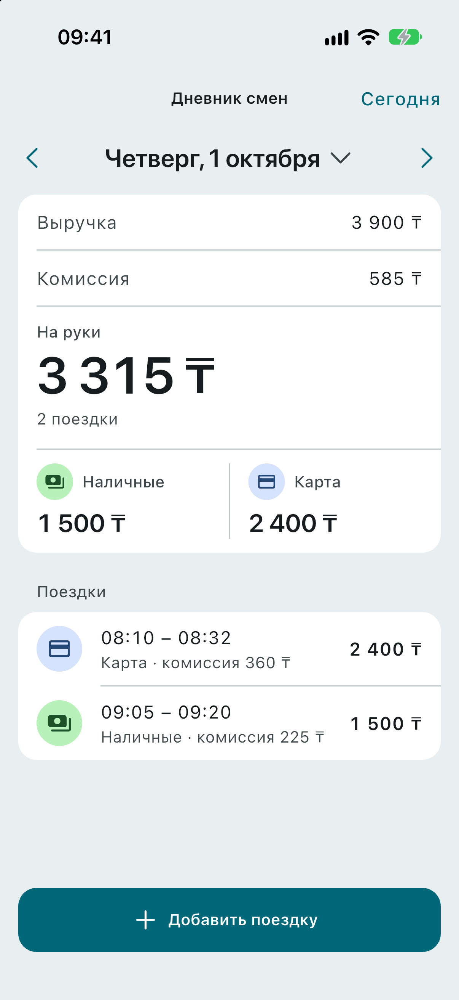<br><sub>01.10: сводка из задания</sub></td>
    <td align="center" valign="top">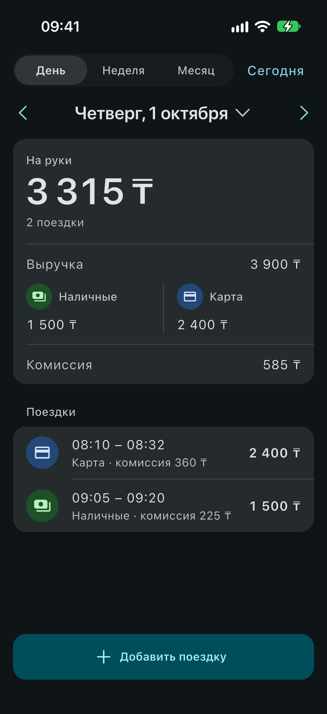<br><sub>Тёмная тема</sub></td>
    <td align="center" valign="top">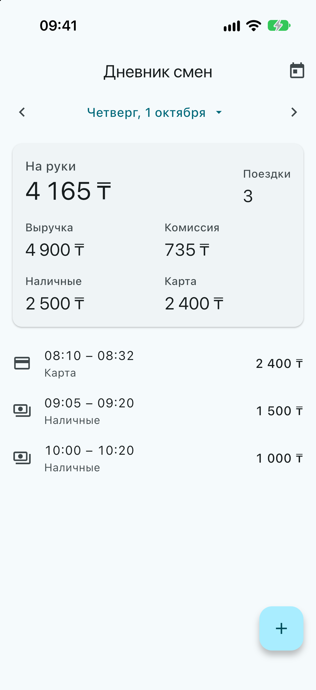<br><sub>01.10 после добавления поездки</sub></td>
    <td align="center" valign="top">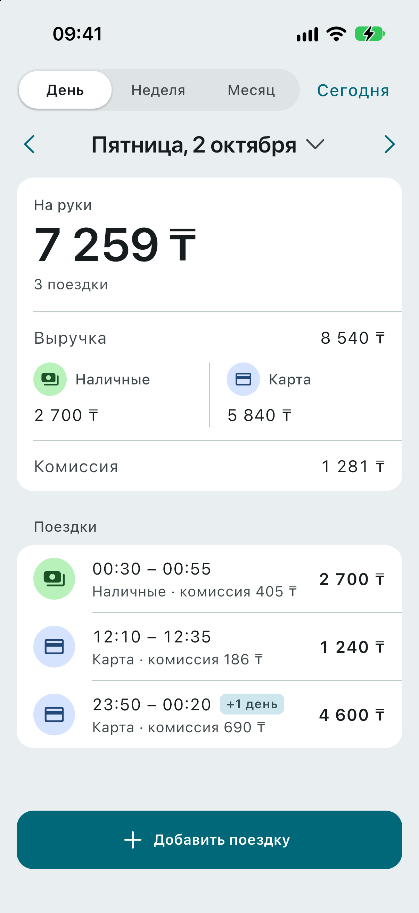<br><sub>02.10: поездка в 00:30 и «+1 день» через полночь</sub></td>
  </tr>
  <tr>
    <td align="center" valign="top">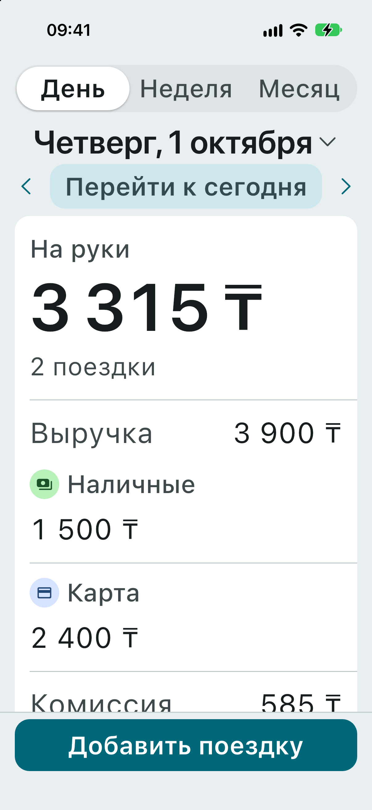<br><sub>Крупный шрифт (AX2, около 200%)</sub></td>
    <td align="center" valign="top">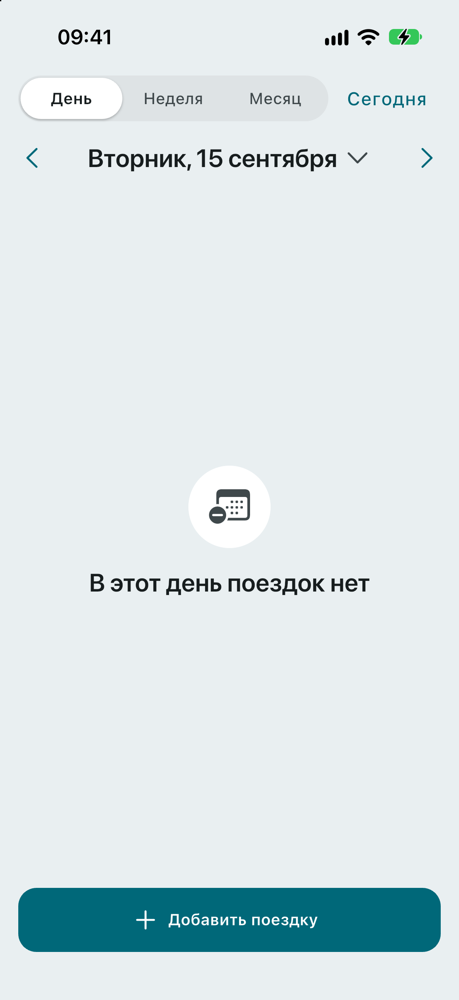<br><sub>Пустой день</sub></td>
    <td align="center" valign="top">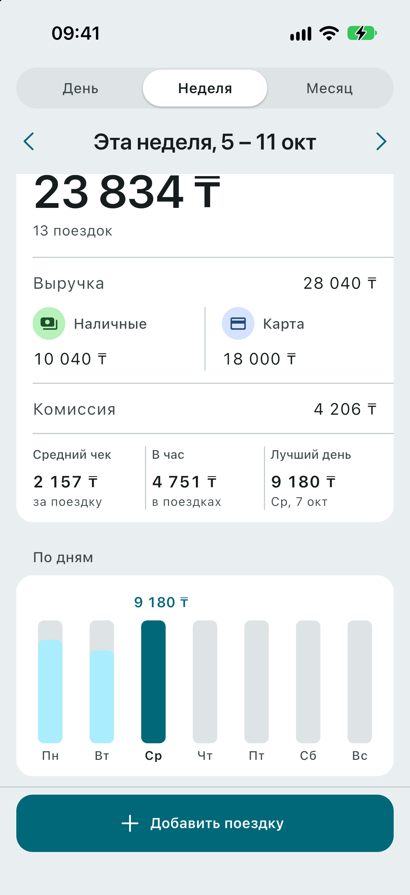<br><sub>Эта неделя: средний чек, в час, лучший день и график</sub></td>
    <td align="center" valign="top">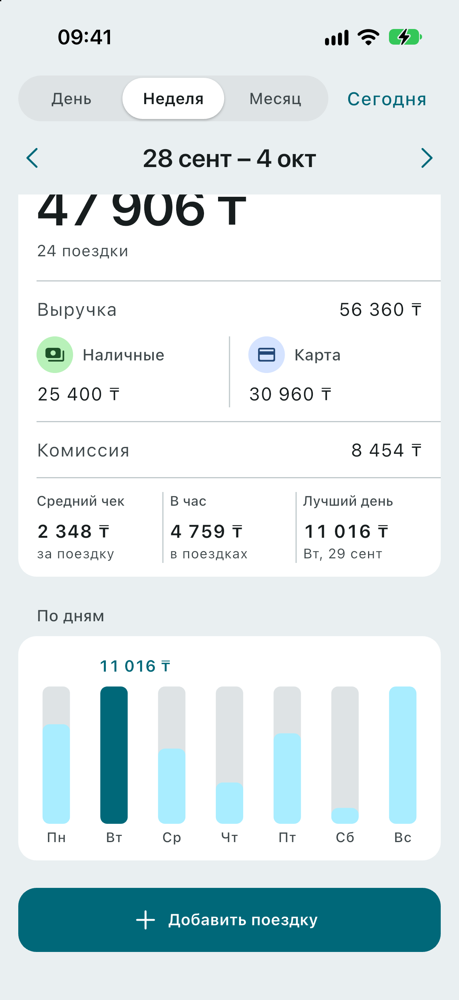<br><sub>Прошлая неделя, 28.09–04.10</sub></td>
  </tr>
  <tr>
    <td align="center" valign="top">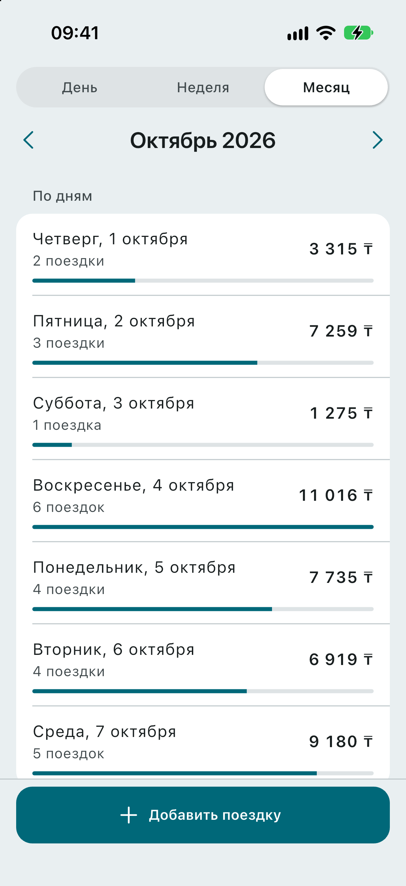<br><sub>Месяц: список дней</sub></td>
    <td align="center" valign="top">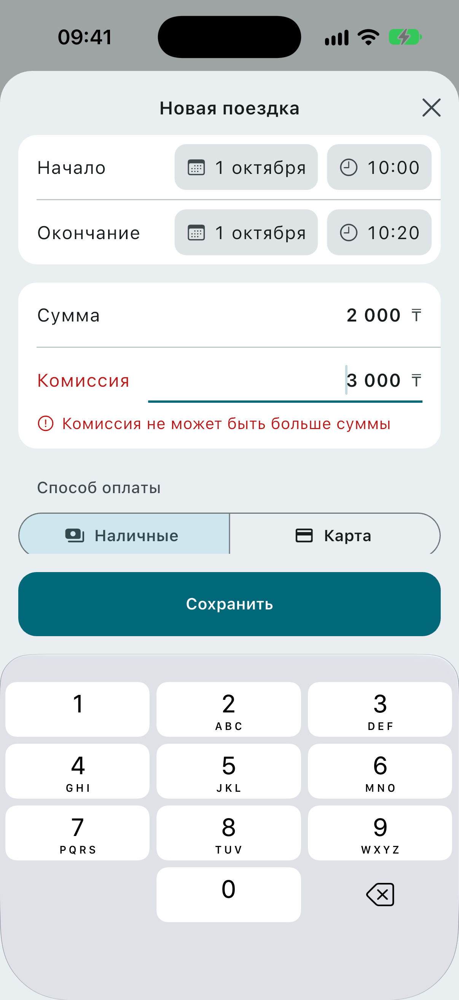<br><sub>Форма: ошибка под полем</sub></td>
    <td align="center" valign="top">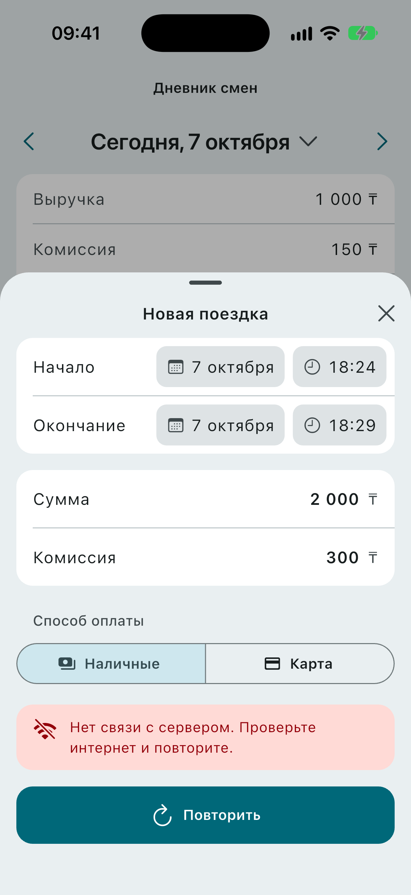<br><sub>Нет связи: «Повторить» с тем же <code>id</code></sub></td>
    <td align="center" valign="top">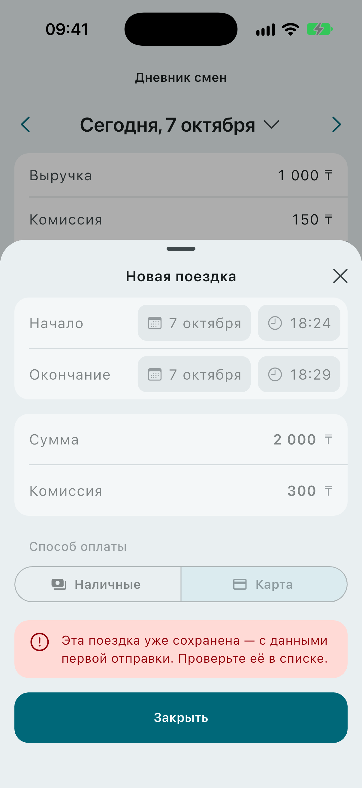<br><sub>Ответ <code>409</code>: поездка уже сохранена</sub></td>
  </tr>
</table>

## Как устроено

```
Flutter-клиент ──HTTP/JSON──▶ FastAPI ──SQL──▶ Postgres
  DayBloc        GET  /days/{date}            summarize()     trips (id PK)
  PeriodBloc     GET  /periods/{start}/{end}  period_report()
  AddTripBloc    POST /trips                  ON CONFLICT
```

- **Бэкенд** — [backend/app/trips/](backend/app/trips/): слои router → service → repository →
  domain, их порядок проверяет `import-linter`. Домен — чистые функции без фреймворков.
- **Клиент** — [app/lib/src/features/shift_diary/](app/lib/src/features/shift_diary/):
  feature-first Clean Architecture и BLoC. Деньги клиент не пересчитывает, время показывает
  по Алматы.
- [docs/architecture.md](docs/architecture.md) — структура, правила, Docker, окружения,
  интерфейс. [docs/api.md](docs/api.md) — контракт API и коды ошибок.
- [CLAUDE.md](CLAUDE.md) — инварианты и правила проекта для людей и ИИ-агентов.
- CI: [backend.yml](.github/workflows/backend.yml) (`make gate-backend`, `make smoke`),
  [app.yml](.github/workflows/app.yml) (свежесть генерации, `make gate-app`),
  [release.yml](.github/workflows/release.yml) (APK по тегу `v*`). План PR —
  [docs/plan.md](docs/plan.md).

## Работа с ИИ

Журнал — [docs/ai-log.md](docs/ai-log.md): реальные случаи, где ИИ ошибся, как это нашлось
и что исправлено, со ссылками на коммиты.

### Как я работаю с ИИ

Архитектуру спроектировал я: стек, слои бэкенда и клиента, ключевые решения
([architecture.md](docs/architecture.md), [decisions.md](docs/decisions.md)). Код по ней почти
целиком написал ИИ (Claude Code): сначала документы и правила в `CLAUDE.md`, потом по одному PR
на строку [плана](docs/plan.md), каждый — отдельный агент в своём worktree. Я ставил задачи,
принимал решения, проверял результат на симуляторе и сам делал шаги, где нужны аккаунты. Подробно, с цифрами и разбором 27 ошибок ИИ — в [docs/ai-log.md](docs/ai-log.md).
